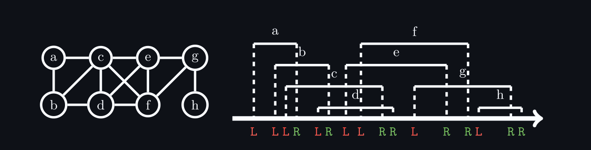
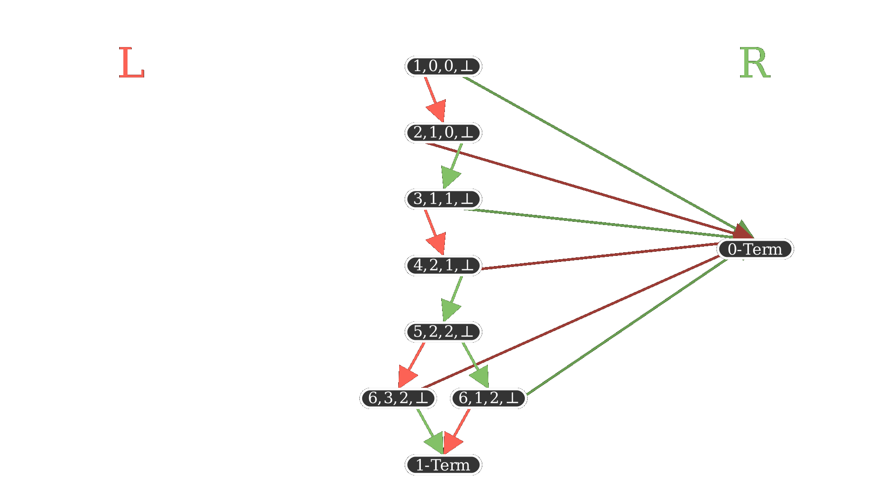
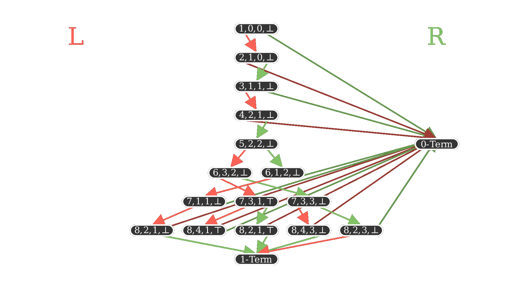
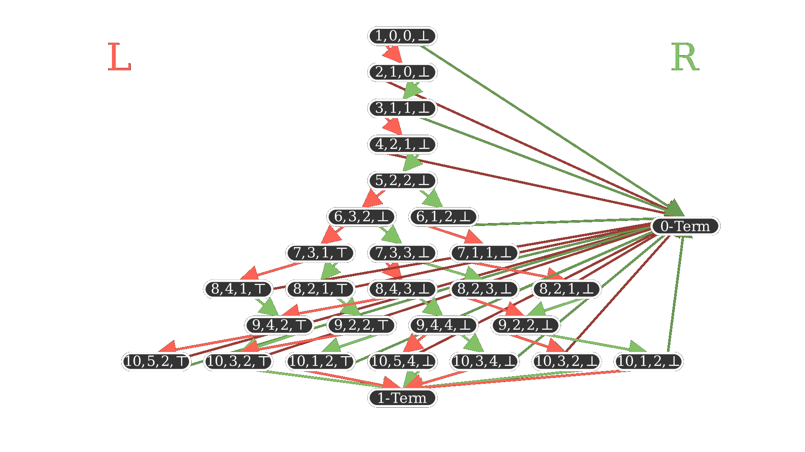

# Perfekte Graphen

## und Algorithmen für bestimmte Teilklassen davon

### Florian Bogner

---

### Definition: Intervall-Schnitt-Graph (auch Intervall-Graph)

Ein Graph heißt Intervall-Schnitt-Graph, wenn es eine Familie von (reellen) Intervallen gibt, die in bijektiv auf die Knoten abgebildet werden und eine Kante zwischen 2 Knoten existiert gdw. die zugehörigen Intervalle überlappen.

---

### Lemma: Interval Graphs sind *trianguliert*.

Beweisskizze:

### Korollar: Interval Graphs sind *perfekt*.

---

### Definition: Ein Interval-Schnitt-Graph heißt *proper*, wenn keines der Intervalle ganz in einem anderen ist.

---

### Binärstring-Darstellung:

Von links nach rechts die Enden der Intervalle mitschreiben.

---

### Definition:

Die *Höhe* eines Strings: $h_s(i) := |c_1 \dots c_i|_L - |c_1 \dots c_i|_R$

Beispiel: mit $s = LLLRLRLLRRLRRLRR$:

$$h_s(2) = 2-0 = 2$$

$$h_s(8) = 6-2 = 4$$

---

### Lemma: Sei $s = c_1 \dots c_{2n}$ eine String-Darstellung eines zusammenhängenden proper Intervall-Graphen $G$. Dann gilt:

- $c_1 = L$ und $c_{2n} = R$
- $s$ hat gleich viele $L$ wie $R$
- $h_s(i) > 0$ für $i$ in $\{1, \dots , 2n-1\}$
- $\max\limits_i h_s(i) = k(G)$

---

### Binary Decision Diagram

ist ein gerichteter azyklischer Graph.

Zwei ausgezeichnete Nodes:

- 0-Terminal und 1-Terminal

Jede andere Node hat einen
linken und rechten Nachfolger.

---

### Binary Decision Diagram

1-Terminal akzeptiert:

- z.B.: LRLR, LLRR

0-Terminal verwirft:

- z.B. LLL, R, LRLL

---

### Intermezzo: *Alternate* eines Strings $s = c_1 \dots c_{2n}$ ist der String von außen nach innen gelesen:

$$\alpha(s) := c_1c_{2n}c_2c_{2n-1}\dots c_n c_{n+1}$$

z.B: 

$$\alpha(abcxyz) = azbycx$$

---

### Enumeration Algorithmus (von Kawahara et al.)

für gegebenes $n \in \mathbb N$ baut Binary Decision Diagram. Sei $s$ ein String:

$\alpha(s)$ wird akzeptiert $\Leftrightarrow$ $s$ repräsentiert einen zusammenhängenden proper Intervalgraphen mit $n$ Knoten (in kanonischer Darstellung)

Die Laufzeit zur Erstellung ist $O(n^3)$.

---

### Enumeration Algorithmus (von Kawahara et al.)

Jeder Node aus dem BDD wird ein sogenannter *State* zugeteilt. Aus dem *State* einer Node kann in konstanter Zeit der State der beiden Nachfolger berechntet werden.

Der *State* einer Node ist $(i, h_L, h_R, F) \in \mathbb N_{\leq 2n} \times  \mathbb N_{\leq n} \times \mathbb N_{\leq n} \times \{\top, \bot\}$

---

---

---

---

# Live Demo!

(pls work)

OEIS: A007123

---

# Danke für Ihre Aufmerksamkeit